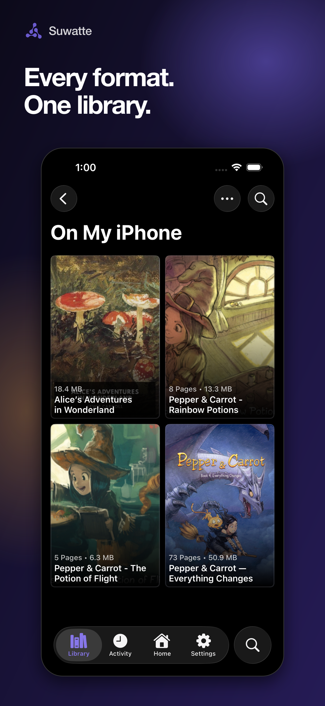
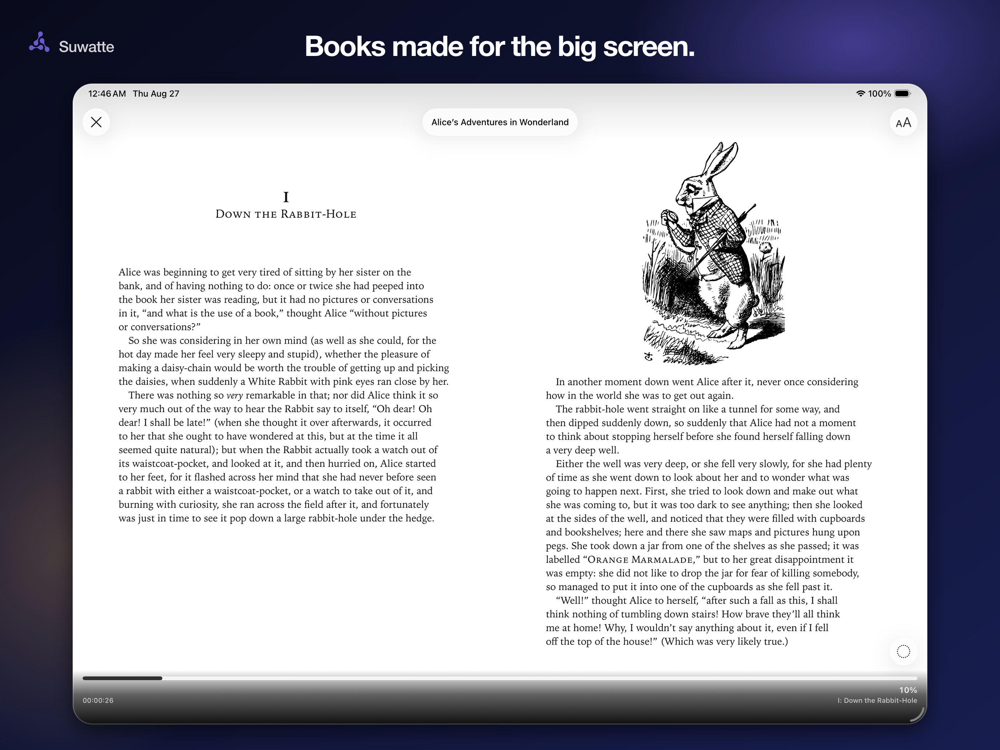

  

# Suwatte

Suwatte is a reader for manga, manhwa, manhua, comics, and novels on iPhone and iPad.
Bring your own files, connect your own server, or install the Sources that you trust.

  <a href="https://testflight.apple.com/join/8JYvZH1n"><strong>Join TestFlight</strong></a>
  ·
  <a href="https://suwatte.mantton.com"><strong>Read the guides</strong></a>

## One library, every format

- Read CBR, CBZ, PDF, and EPUB files.
- Connect Komga, Kavita, and OPDS servers.
- Browse compatible third-party Sources.
- Sync your library, collections, and reading progress with iCloud.
- Choose paged, vertical, manga, and comic reading modes.
- Keep reading history, sessions, insights, and panel bookmarks.

## A reader that fits the page

| iPhone | iPad |
| --- | --- |
|  |  |

## Your content stays yours

Suwatte ships with no Sources, catalogue, or bundled books. You choose the files and services that
the app can access. Suwatte has no advertising or developer-operated product analytics.

For help, email [help@mantton.com](mailto:help@mantton.com).

## Screenshot credit

Screenshots include *Pepper & Carrot* by David Revoy and contributors, licensed under
[CC BY 4.0](https://creativecommons.org/licenses/by/4.0/), and *Alice's Adventures in Wonderland*
from [Standard Ebooks](https://standardebooks.org/), whose edition is dedicated to the public
domain through CC0. Screenshots are cropped. David Revoy and Standard Ebooks do not endorse
Suwatte.

This repository contains the Suwatte website, guides, and App Store marketing artwork.
